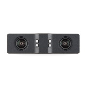

# ĐO KÍCH THƯỚC VẬT THỂ BẰNG STEREO CAMERA

## TỔNG QUAN

Đây là bài viết hướng dãn cách sử dụng stereo camera và ứng dụng của stereo trong ứng dụng thực tế là đo kích thước 3 chiều của một vật thể
cụ thể là đo kích thước hình hộp
Bài hướng dẫn bao gồm 3 phần:
1/ Cách stereo camera tính độ sâu
2/ Cách cài đặt và sử dụng thư viện librealsene2 trên Window và Linux
3/ Giải thuật thực hiện trong ứng dụng đo kích thước hình hộp

## 1/ Cách stereo camera tính độ sâu

Ở phần này, chúng ta sẽ tìm hiểu xem stereo camera là gì và cách để nó có thể tính độ sâu
* Stereo camera là một hệ thống gồm 2 hoặc nhiều hơn camera kết hợp với nhau, với mục tiêu mô phỏng mắt người để có thể tính độ sâu

