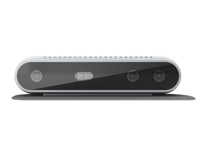
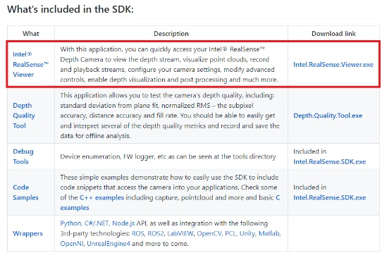
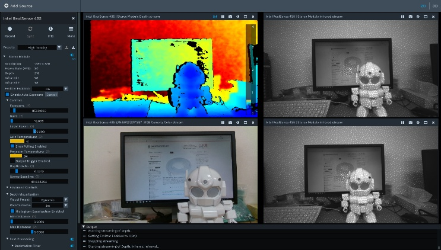
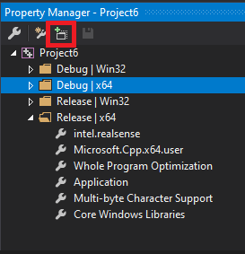
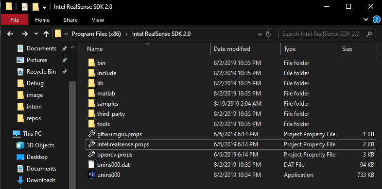

# ĐO KÍCH THƯỚC VẬT THỂ BẰNG STEREO CAMERA

## TỔNG QUAN

Đây là bài viết hướng dãn cách sử dụng stereo camera và ứng dụng của stereo trong ứng dụng thực tế là đo kích thước 3 chiều của một vật thể
cụ thể là đo kích thước hình hộp
Bài hướng dẫn bao gồm 3 phần:
1/ Cách stereo camera tính độ sâu
2/ Cách cài đặt và sử dụng thư viện librealsene2 trên Window và Linux
3/ Giải thuật thực hiện trong ứng dụng đo kích thước hình hộp

## 1/ Cách stereo camera tính độ sâu

Ở phần này, chúng ta sẽ tìm hiểu xem stereo camera là gì và cách để nó có thể tính độ sâu
* Stereo camera là một hệ thống gồm 2 hoặc nhiều hơn camera kết hợp với nhau, với mục tiêu mô phỏng mắt người để có thể tính độ sâu

* Để tính được độ sâu, ban đầu chúng ta sẽ chiếu điểm cần tính độ sâu xuống 2 mặt phẳng ảnh

Đến đây ta sẽ làm quen với một khái niệm là Disparity

Trong đó:

    - x là khoảng cách của điểm đang xét trên mặt phẳng ảnh 1 đến trung tâm của bức ảnh theo trục hoành
    - x' là khoảng cách của điểm đang xét trên mặt phẳng ảnh 2 đến trung tâm của bức ảnh theo trục hoành
    - f là tiêu cự của stereo camera
    - B (Baseline) là khoảng cách giữa 2 tâm cảm biến của 2 camera trong hệ thống stereo camera
    - Z chính là khoảng cách từ stereo camera đến điểm cần được tính độ sâu

Đến đây chúng ta đã nắm được cách stereo tính độ sâu, tiếp theo chúng ta sẽ làm quen với thư viện librealsense2

## 2/ Cách cài đặt và sử dụng thư viện librealsene2 trên Window và Linux

Ở bài hướng dẫn này sẽ sử dụng stereo depth camera Intel Realsense D415

Stereo Depth Camera D415 là một stereo camera của hãng Intel, Intel cung cấp cho chúng ta một gói thư viện SDK bao gồm rất nhiều ví dụ kèm code mẫu, wrapper cho python, c#,...

[Intel® RealSense™ SDK 2.0](https://github.com/IntelRealSense/librealsense)

Thư viện này có thể hoạt động trên 3 hệ điều hành phổ biến nhất hiện nay là Window, Linux và MacOs

* Cách cài đặt và sử dụng trên Window

Để có thể cài đặt thư viện trên window, chúng ta làm theo các bước sau:

Cài đặt ô được khoanh đỏ để tải thư viện và phần mềm để giao tiếp với D415: [Intel.RealSense.Viewer.exe](https://github.com/IntelRealSense/librealsense/releases)

Sau khi tải xuống máy xong, ta nhấn file vừa tải xuống để tiến hành cài đặt. Quá trình cài đặt rất đơn giản, chúng ta chỉ cần nhấn "Next" và cuối cùng nhấn "Install" để tiến hành cài.
Sau khi cài xong thư viện và phần mềm sẽ được lưu trong "C:\Program Files (x86)\Intel RealSense SDK 2.0"

Để xác nhận việc cài đặt đã thành công, chúng ta mở ứng dụng Intel Realsense Viewer và cắm D415 vào máy tính để kiểm tra máy có kết nối thành công hay không

Phần mềm dùng để chạy code mẫu và lập trình được sử dụng trong bài hướng dẫn này là [Visual Studio Community 2017](https://docs.microsoft.com/vi-vn/visualstudio/releasenotes/vs2017-relnotes)

Thư viện librealsense2 cung cấp cho ta sẵn các project mẫu để chạy trên Visual Studio, nên chúng ta chỉ cần vào đường dẫn sau để mở và chạy thử: "C:\Program Files (x86)\Intel RealSense SDK 2.0\samples"

Để sử dụng thư viện librealsense2 trên phần mềm Visual Studio này thì chúng ta phải add thư viện này vào project của chúng ta, việc add được thực hiện đơn giản như sau:

    - Bước 1: Mở View -> Other Windows -> Property Manager
    - Bước 2: Chọn vào thẻ Property Manager và chọn Project cần add thư viện
    - Bước 3: Nhấn vào Add Existing Property Sheet (Một cửa sổ sẽ hiện lên để chúng ta chọn file property)

    
    - Bước 4: Đi đến đường dẫn "C:\Program Files (x86)\Intel RealSense SDK 2.0" rồi chọn file "intel.realsense.props" để hoàn thành add thư viện librealsense2

Một lưu ý khi sử dụng thư viện librealsense2 đó là bạn phải build và chạy project ở chế độ 64 bit (x64)